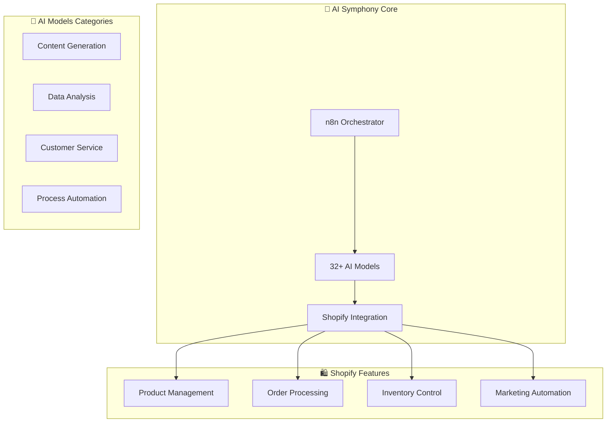

# 🏗️ Dynamic AI Symphony Manager - Architecture

## 📊 النظرة الشاملة

### نظام متطور يدمج 32+ نموذج AI مع n8n لإدارة متاجر Shopify

## 🎯 المكونات الرئيسية

### 1. **n8n Orchestrator** 🎭
- **الدور**: مركز التحكم والتنسيق
- **المنفذ**: 5678
- **الواجهة**: Web UI
- **المصادقة**: admin/Symphony2025

### 2. **AI Models Hub** 🧠
نماذج الذكاء الاصطناعي المدمجة:

#### **Content Generation (10 models)**
- GPT-4 Turbo
- Claude 3 Opus
- Gemini Pro
- DALL-E 3
- Midjourney API
- Stable Diffusion XL
- LLaMA 3
- Mistral Large
- Command R+
- PaLM 2

#### **Analysis & Insights (8 models)**
- Data Analyst Pro
- Market Trends Predictor
- Customer Behavior Analyzer
- Sales Forecaster
- Inventory Optimizer
- Price Intelligence
- Competitor Monitor
- Review Sentiment Analyzer

#### **Customer Service (7 models)**
- Support Bot Ultra
- FAQ Generator
- Ticket Classifier
- Response Composer
- Language Translator
- Emotion Detector
- Escalation Predictor

#### **Process Automation (7 models)**
- Workflow Designer
- Task Prioritizer
- Email Automator
- Report Generator
- Code